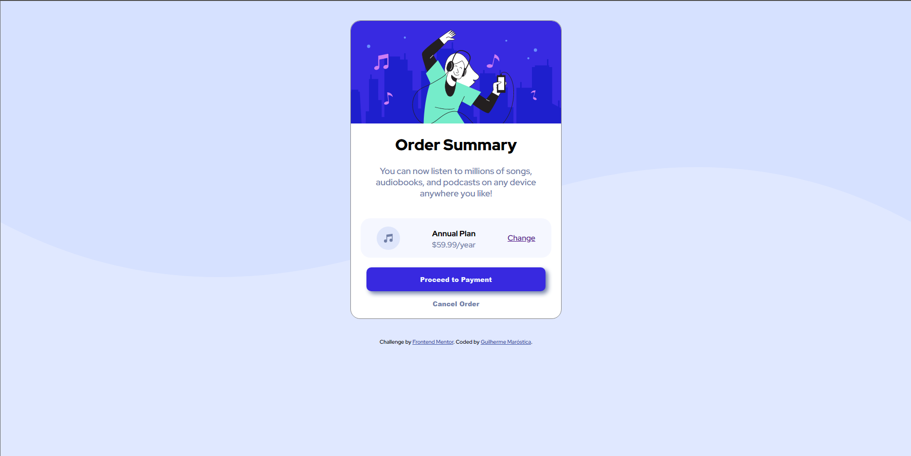

# Frontend Mentor - Order summary card solution

This is a solution to the [Order summary card challenge on Frontend Mentor](https://www.frontendmentor.io/challenges/order-summary-component-QlPmajDUj). Frontend Mentor challenges help you improve your coding skills by building realistic projects. 

## Table of contents

- [Overview](#overview)
  - [The challenge](#the-challenge)
  - [Screenshot](#screenshot)
  - [Links](#links)
- [My process](#my-process)
  - [Built with](#built-with)
  - [Continued development](#continued-development)
  - [Useful resources](#useful-resources)
- [Author](#author)

## Overview

### The challenge

Users should be able to:

- See hover states for interactive elements

### Screenshot

### Links

- Solution URL: [Solution](https://github.com/Guilherme-Marostica-dev/Order-summary-card)
- Live Site URL: [Vercel App](https://order-summary-card-zeta.vercel.app)

## My process

### Built with

- Semantic HTML5 markup
- CSS custom properties
- Flexbox
- Mobile-first workflow

### Continued development

This is the second project that I complete focusing in front end. My skills as a front end developer still growing and I learning even more in any challenge that I try. My goal with these challenges is practice everyday to become a fullstack developer. 

### Useful resources

- [Flexbox guide](https://css-tricks.com/snippets/css/a-guide-to-flexbox/) - This helped me in flexbox properties in CSS.

## Author

- Frontend Mentor - [@yourusername](https://www.frontendmentor.io/profile/yourusername)
- Twitter - [@yourusername](https://www.twitter.com/guivisch1)
